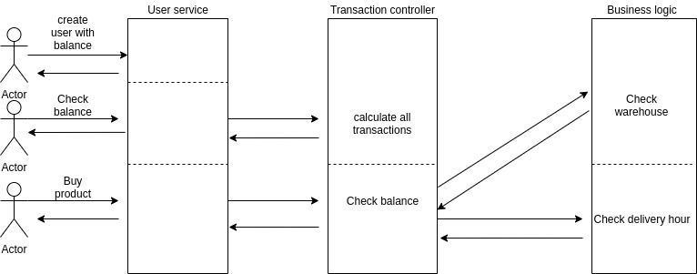

## Домашнее задание №10

Реализован двухфазный коммит.
Баланс каждый раз считается в менеджере транзакций только по успешным по всем пунктам.


### Запуск

Проверить что в minikube есть ingress:

`minikube addons enable ingress`

Из папки hw10 применить команду

```
kubectl apply -f . &&
kubectl apply -f ./secrets -n hw10 &&
helm repo add bitnami https://charts.bitnami.com/bitnami &&
helm install service bitnami/postgresql -n hw10 -f ./helm/values.yaml &&
kubectl apply -f ./config -n hw10 &&
kubectl apply -f ./python_app -n hw10
```

Для запуска тестов выполнить команду:

`newman run ./test/hw10.postman_collection.json`

Действия в тестах:

Создают пользователя с балансом 110.

Совершают покупку за 10.

Падают при попытке покупки за 200.

Падают при заказе на пустой склад.

Падают при заказе на время когда нет курьеров.

Совершают покупку за 10.

Проверяют, что учитываются только успешные покупки.


### Задание 
В этом ДЗ вы научитесь реализовывать распределенную транзакцию.

Описание/Пошаговая инструкция выполнения домашнего задания:
Можно использовать приведенный ниже сценарий для интернет-магазина или придумать свой.
Дефолтный сценарий:
Реализовать сервисы "Платеж", "Склад", "Доставка".
Для сервиса "Заказ", в рамках метода "создание заказа" реализовать механизм распределенной транзакции (на основе Саги или двухфазного коммита).
Во время создания заказа необходимо:

в сервисе "Платеж" убедиться, что платеж прошел
в сервисе "Склад" зарезервировать конкретный товар на складе
в сервисе "Доставка" зарезервировать курьера на конкретный слот времени. Если хотя бы один из пунктов не получилось сделать, необходимо откатить все остальные изменения. На выходе должно быть:
описание того, какой паттерн для реализации распределенной транзакции использовался
команда установки приложения (из helm-а или из манифестов). Обязательно указать в каком namespace нужно устанавливать и команду создания namespace, если это важно для сервиса.
тесты в postman В тестах обязательно
использование домена arch.homework в качестве initial значения {{baseUrl}}

### Код
В папке `python_docker_code` исходный код приложения

### Неисправности
Если не работает, проверить что в `etc/hosts` прописан адрес из команды `minikube ip`

`192.168.49.2 arch.homework`
